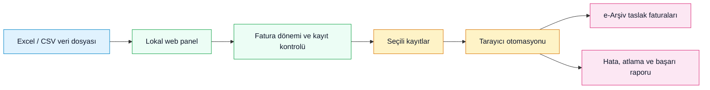
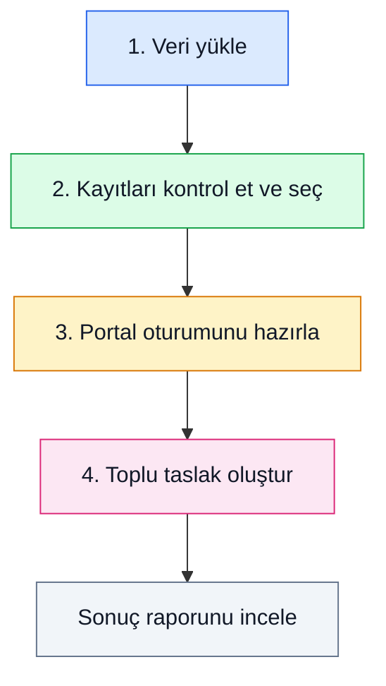
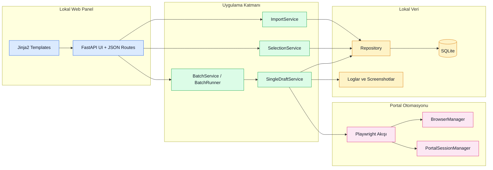

# e-Arşiv Taslak Fatura Otomasyonu


Bu proje, Excel veya CSV dosyalarındaki kişi kayıtlarından toplu şekilde e-Arşiv taslak faturası oluşturmak için geliştirilmiş lokal bir otomasyon yazılımıdır. Amaç, manuel veri girişini azaltmak, kayıtları dönem bazında yönetmek, uygun kişileri seçmek, portal üzerinden taslak fatura oluşturma işini otomasyona bırakmak ve her kaydın sonucunu anlaşılır şekilde raporlamaktır.

Uygulama yalnızca yerel bilgisayarda çalışır. Veriler lokal SQLite veritabanında tutulur, kullanıcı oturumu yerel tarayıcı otomasyonu üzerinden yönetilir ve işlem sonunda her kayıt için başarılı, atlandı, hatalı veya kritik nedenle durdu gibi net durumlar üretilir.

> [!IMPORTANT]
> Bu yazılım GİB'e otomatik gönderim yapmaz. Hedef, toplu kayıtlar için e-Arşiv taslak faturası oluşturmaktır. Son kontrol ve resmi gönderim sorumluluğu kullanıcıdadır.

---

## İçindekiler

- [Programın Amacı](#programın-amacı)
- [Büyük Resim](#büyük-resim)
- [Öne Çıkan Yetenekler](#öne-çıkan-yetenekler)
- [Neyi Otomatikleştirir, Neyi Yapmaz](#neyi-otomatikleştirir-neyi-yapmaz)
- [Kurulum](#kurulum)
- [Ortam Ayarları](#ortam-ayarları)
- [Çalıştırma](#çalıştırma)
- [Veri Formatı](#veri-formatı)
- [Kullanım Akışı](#kullanım-akışı)
- [Kayıt Durumları](#kayıt-durumları)
- [Raporlama ve Loglar](#raporlama-ve-loglar)
- [Teknik Mimari](#teknik-mimari)
- [Güvenlik ve Operasyon Notları](#güvenlik-ve-operasyon-notları)
- [Test](#test)
- [Sınırlar](#sınırlar)

---

## Programın Amacı

Şirketler, tur organizasyonları veya benzer toplu müşteri operasyonları e-Arşiv taslak faturalarını çoğu zaman tekrar eden bilgilerle hazırlar. Her kişi için ad, soyad, TCKN, tutar, döviz, istisna ve fatura kalemi gibi bilgilerin tekrar tekrar girilmesi zaman kaybı yaratır ve insan hatasına açıktır.

Bu uygulama bu süreci tek bir lokal panel altında toplar:

- Dosyadaki kayıtları içeri alır.
- Kayıtları fatura dönemi mantığıyla gruplar.
- Kullanıcıya kayıtları kontrol etme, arama, sıralama ve seçme imkanı verir.
- Seçilen kayıtlar için e-Arşiv taslak fatura oluşturma sürecini otomatikleştirir.
- Hatalı veya atlanan kişileri batch'i gereksiz yere durdurmadan raporlar.
- Kritik oturum veya portal problemi olursa işlemi güvenli biçimde durdurur.

Kısaca: bu proje, toplu e-Arşiv taslak fatura hazırlama işini daha hızlı, kontrollü ve raporlanabilir hale getiren bir masaüstü/lokal web otomasyonudur.

---

## Büyük Resim



Uygulama kullanıcıdan gelen Excel/CSV dosyasını okur, kayıtları lokal veritabanında saklar, kullanıcı tarafından seçilen kayıtları sırayla işler ve sonuçları tekrar lokal panelde gösterir.

---

## Öne Çıkan Yetenekler

| Alan | Yetenek |
| --- | --- |
| Veri alma | `.xlsx`, `.xls` ve `.csv` dosyalarını içeri aktarır. |
| Excel desteği | Çok sheet'li Excel dosyalarında sheet seçimi yapabilir. |
| Kolon eşleştirme | Ad, soyad, TCKN ve tutar alanlarını kullanıcı kontrollü eşleştirir. |
| Fatura dönemi | Her importu ayrı fatura dönemi olarak saklar. |
| Kayıt kontrolü | Aktif fatura dönemindeki kayıtları listeler, arar, sıralar ve filtreler. |
| Canlı arama | Ad, soyad veya TCKN yazıldıkça sonuçları beklemeden günceller. |
| Sıralama | Ad, soyad, TC kimlik no, tutar veya kayıt sırasına göre artan/azalan sıralar. |
| Seçim yönetimi | Sadece işlenebilir kayıtları seçime açar; tamamlanmış kayıtları korur. |
| Oturum yönetimi | Portal oturumunu headful tarayıcıyla yönetir, 2FA sürecini kullanıcı kontrolünde bırakır. |
| Taslak oluşturma | Seçili kayıtlar için e-Arşiv taslak fatura oluşturma akışını otomatikleştirir. |
| Hata dayanıklılığı | Kayıt bazlı hatalarda batch'i devam ettirir. |
| Kritik durdurma | Oturum kaybı gibi kritik durumlarda işlemi güvenli durdurur. |
| Raporlama | Başarılı, hatalı, atlanan ve durdurulan kayıtları özet ve detay olarak raporlar. |
| Screenshot | Hata anında ekran görüntüsü alarak inceleme kolaylığı sağlar. |
| Uyku önleme | Toplu işlem sırasında bilgisayarın uyumasını engellemeye çalışır. |

---

## Neyi Otomatikleştirir, Neyi Yapmaz

### Otomatikleştirdiği işler

- Toplu kişi verisinin uygulamaya alınması.
- Fatura dönemi bazlı kayıt yönetimi.
- Kayıt arama, filtreleme, sıralama ve seçim.
- Portal oturumunun otomasyon için hazırlanması.
- Seçili kayıtlar için taslak e-Arşiv fatura oluşturma.
- Kayıt bazlı hata sınıflandırma.
- Hata screenshot ve log kaydı.
- Batch sonunda sonuç raporu üretme.

### Bilinçli olarak yapmadığı işler

- GİB'e otomatik gönderim yapmaz.
- 2FA kodunu otomatik çözmez veya saklamaz.
- Portal şifresini uzak bir sunucuya göndermez.
- Çok kullanıcılı yetki/rol sistemi sunmaz.
- Uzak sunucu deployment veya cloud çalışma modu sağlamaz.
- Tamamlanmış veya hatalı kayıtları kendiliğinden tekrar deneme kuyruğuna almaz.

---

## Kurulum

### Gereksinimler

- Python 3.11 veya üzeri
- Chromium destekli Playwright kurulumu
- Lokal çalıştırma için terminal erişimi
- Portal erişim bilgileri

### macOS / Linux

```bash
python3 -m venv venv
source venv/bin/activate
pip install -r requirements.txt
python -m playwright install chromium
```

### Windows PowerShell

```powershell
py -3 -m venv venv
.\venv\Scripts\Activate.ps1
pip install -r requirements.txt
python -m playwright install chromium
```

> [!NOTE]
> Projede halihazırda `venv/` klasörü kullanılıyorsa aynı isimle devam edebilirsiniz. Farklı bir sanal ortam adı kullanmanız teknik olarak mümkündür; önemli olan komutları aktif sanal ortam içinde çalıştırmaktır.

---

## Ortam Ayarları

Örnek ortam dosyasını kopyalayın:

```bash
cp .env.example .env
```

Temel ayarlar:

```env
APP_HOST=127.0.0.1
APP_PORT=8000
APP_DEBUG=false

DATABASE_PATH=data/invoice_automation.sqlite3
LOG_FILE_PATH=data/logs/app.log
IMPORT_DIR=data/imports
SCREENSHOT_DIR=data/logs/screenshots

PORTAL_LOGIN_URL=https://portal.hizliteknoloji.com.tr/
PORTAL_2FA_URL=https://portal.hizliteknoloji.com.tr/User/VerificationUser?verificationType=Mail
PORTAL_USERNAME=
PORTAL_PASSWORD=

PLAYWRIGHT_HEADLESS=false
PLAYWRIGHT_TIMEOUT_MS=30000
```

Fatura varsayılanları:

```env
MAL_HIZMET_ADI=YURT DIŞI KONAKLAMA BEDELİ
MIKTAR=1
PARA_BIRIMI=USD
KUR_TIPI=Dolar
KDV_ORANI=0
ISTISNA_KODU=302.11
ISTISNA_TARGET_TEXT=302-11/1-a Hizmet ihracatı
DEFAULT_IL=**
DEFAULT_ILCE=**
DRAFT_MODE=true
```

Dayanıklılık ve bekleme ayarları:

```env
NAVIGATION_RETRY_COUNT=2
FIELD_WAIT_TIMEOUT_MS=30000
REDIRECT_WAIT_TIMEOUT_MS=30000
TURMOB_LOOKUP_RETRY_COUNT=2
RETRY_BACKOFF_BASE_MS=500
TAX_SCHEME_PREFILL_WAIT_MS=2000
DRAFT_SAVE_WAIT_MS=2000
```

Toplu işlem sırasında uyku önleme:

```env
SLEEP_PREVENTION_ENABLED=true
SLEEP_PREVENTION_PLATFORM=auto
SLEEP_PREVENTION_KEEP_DISPLAY_AWAKE=true
```

`SLEEP_PREVENTION_PLATFORM=auto` ayarı işletim sistemini otomatik algılar. macOS üzerinde `caffeinate`, Windows üzerinde native execution state, Linux üzerinde uygun olduğunda `systemd-inhibit` kullanılır.

> [!WARNING]
> `.env` dosyası portal kullanıcı adı ve şifre bilgilerini içerebilir. Bu dosyayı Git'e commit etmeyin ve başka kişilerle paylaşmayın.

---

## Çalıştırma

```bash
python run.py
```

Uygulama varsayılan olarak şu adreste açılır:

```text
http://127.0.0.1:8000
```

Runtime dosyaları proje içindeki `data/` klasörü altında tutulur:

```text
data/
  imports/                 # Yüklenen dosyalar
  logs/app.log             # Uygulama logları
  logs/screenshots/        # Hata ekran görüntüleri
  invoice_automation.sqlite3
```

---

## Veri Formatı

Uygulama Excel veya CSV içinden aşağıdaki alanları bekler.

| Alan | Zorunlu | Açıklama |
| --- | --- | --- |
| `ad` | Evet | Kişinin adı. |
| `soyad` | Evet | Kişinin soyadı. |
| `tc_kimlik_no` | Evet | TC kimlik numarası veya portalın beklediği kimlik bilgisi. |
| `tutar_usd` | Evet | USD cinsinden fatura tutarı. |
| `aciklama` | Hayır | Kayıt açıklaması veya operasyon notu. |

Tutar alanı farklı yazımları normalize edecek şekilde ele alınır:

| Örnek değer | Beklenen anlam |
| --- | --- |
| `$1.450` | 1450 USD |
| `1.450` | 1450 USD |
| `$1,450` | 1450 USD |
| `$1450.75` | 1450.75 USD |
| `850` | 850 USD |

Boş, metinsel veya parse edilemeyen tutarlar import sırasında satır bazlı hata olarak raporlanır.

---

## Kullanım Akışı

Bu uygulama dört ana operasyon adımı etrafında çalışır:



### 1. Veri yükleme

Excel veya CSV dosyası içeri alınır. Excel dosyasında birden fazla sheet varsa kullanılacak sheet seçilir. Uygulama her importu ayrı bir fatura dönemi olarak saklar.

### 2. Kayıt kontrolü ve seçim

Aktif fatura dönemindeki kişiler listelenir. Kullanıcı kayıtları hızlıca arayabilir, duruma göre filtreleyebilir, ad/soyad/TCKN/tutar alanlarına göre sıralayabilir ve taslak oluşturulacak kayıtları seçebilir.

### 3. Oturum hazırlığı

Portal oturumu yerel tarayıcı otomasyonu ile hazırlanır. 2FA gerekiyorsa kod kullanıcı tarafından manuel girilir. Oturum hazır olduğunda toplu işlem başlatılabilir.

### 4. Toplu taslak oluşturma

Seçili ve işlenebilir kayıtlar sırayla ele alınır. Her kayıt için taslak fatura oluşturma denemesi yapılır. Başarılı kayıtlar tamamlanmış olarak işaretlenir; kayıt bazlı hatalarda işlem mümkün olduğunca sonraki kişiye geçer.

### 5. Sonuç raporu

Batch sonunda başarılı, hatalı, atlanan ve durdurulan kayıtlar özetlenir. Hata mesajları, durum kodları ve varsa screenshot path bilgisi raporda görünür.

---

## Kayıt Durumları

| Renk | Durum | Anlam |
| --- | --- | --- |
|  | `PENDING` | Kayıt import edildi, henüz işlenmedi. |
|  | `SELECTED` | Kayıt kullanıcı tarafından batch için seçildi. |
|  | `IN_PROGRESS` | Kayıt işleniyor. |
|  | `SUCCESS_DRAFT_CREATED` | Taslak fatura başarıyla oluşturuldu. |
|  | `FAILED_INVALID_TCKN` | Kimlik numarası portal veya format doğrulamasından geçmedi. |
|  | `FAILED_NAME_MISMATCH` | Portal/Turmob ad-soyad bilgisi lokal kayıtla eşleşmedi. |
|  | `FAILED_TURMOB_SERVICE_ERROR` | Turmob servisinden hata alındı. |
|  | `SKIPPED_EFATURA_MUKELLEFI` | Kişi e-Fatura mükellefi olduğu için e-Arşiv taslak süreci atlandı. |
|  | `FAILED_PORTAL_TIMEOUT` | Portal beklenen sürede yanıt vermedi. |
|  | `FAILED_UNKNOWN` | Sınıflandırılamayan kayıt bazlı hata oluştu. |
|  | `ABORTED_SESSION_LOST` | Oturum veya browser kritik nedenle kaybedildi, batch güvenli durduruldu. |

---

## Raporlama ve Loglar

Uygulama her batch sonunda hem özet hem detay üretir:

- Toplam seçili kayıt sayısı.
- İşlenen kayıt sayısı.
- Başarılı taslak sayısı.
- Atlanan kayıt sayısı.
- Hatalı kayıt sayısı.
- Kritik nedenle durdurulan kayıt sayısı.
- Kayıt bazlı durum, hata kodu, hata mesajı ve screenshot path bilgisi.

Dosya konumları:

| Dosya / klasör | Amaç |
| --- | --- |
| `data/invoice_automation.sqlite3` | Lokal SQLite veritabanı. |
| `data/imports/` | Uygulamaya yüklenen import dosyaları. |
| `data/logs/app.log` | Uygulama ve otomasyon logları. |
| `data/logs/screenshots/` | Hata anında alınan ekran görüntüleri. |

> [!TIP]
> Bir kayıt hatalı görünüyorsa önce batch raporundaki durum koduna, ardından hata mesajına ve varsa screenshot dosyasına bakın. Bu üç bilgi genellikle hatanın veri kaynaklı mı, portal kaynaklı mı, yoksa oturum kaynaklı mı olduğunu hızlıca ayırır.

---

## Teknik Mimari



Ana teknolojiler:

| Teknoloji | Rol |
| --- | --- |
| Python | Uygulama dili. |
| FastAPI | Lokal web panel ve JSON API. |
| Jinja2 | Server-rendered HTML ekranlar. |
| Bootstrap 5 | Panel görünümü ve form/tablo bileşenleri. |
| SQLite | Lokal kalıcı veri katmanı. |
| Pandas / openpyxl | Excel ve CSV okuma. |
| Playwright | Headful browser otomasyonu. |
| pytest | Test paketi. |

Mimari yaklaşım:

- UI route'ları, import/selection/batch/draft servislerinden ayrıdır.
- SQLite erişimi repository katmanında toplanır.
- Her import bir fatura dönemidir; kayıtlar `batch_id` ile ayrılır.
- Portal otomasyonu `automation/` katmanında izole tutulur.
- Kayıt bazlı hatalar batch'i durdurmaz; kritik oturum hataları batch'i güvenli durdurur.
- Testler servis, repository ve otomasyon yardımcı katmanlarını kapsar.

---

## Güvenlik ve Operasyon Notları

- Uygulama lokal çalışmak üzere tasarlanmıştır.
- `.env` dosyası gizli kabul edilmelidir.
- 2FA kodu uygulamada saklanmaz.
- Portal şifresi yalnızca lokal `.env` dosyasından okunur.
- Canlı kullanım öncesi küçük bir kayıt grubu ile pilot deneme yapılmalıdır.
- Portal arayüzü değişirse otomasyon selector ve bekleme davranışları yeniden doğrulanmalıdır.
- Batch sırasında bilgisayarın uyuması engellenmeye çalışılır, ancak işletim sistemi izinleri ve güç ayarları yine de kontrol edilmelidir.

Önerilen canlı kullanım hazırlığı:

| Kontrol | Beklenen sonuç |
| --- | --- |
| `.env` portal bilgileri | Kullanıcı adı ve şifre doğru. |
| Import dosyası | Doğru sheet ve doğru kolonlar seçilmiş. |
| Kayıt listesi | Aktif fatura döneminde beklenen kişiler görünüyor. |
| Seçim | Sadece işlenecek kişiler seçilmiş. |
| Oturum | Portal oturumu hazır. |
| Pilot batch | Küçük kayıt grubuyla doğrulama yapılmış. |
| Rapor | Başarı/hata/atlama dağılımı kontrol edilmiş. |

---

## Test

Tüm testleri çalıştırmak için:

```bash
pytest
```

Sanal ortamı doğrudan kullanmak isterseniz:

```bash
venv/bin/python -m pytest
```

Template parse kontrolü için:

```bash
venv/bin/python -c "from pathlib import Path; from jinja2 import Environment, FileSystemLoader; d = Path('invoice_automation/app/templates'); env = Environment(loader=FileSystemLoader(d)); [env.get_template(p.name) for p in d.glob('*.html')]; print('templates ok')"
```

---

## Sınırlar

Bu proje pratik ve kontrollü bir v1 otomasyonudur. Aşağıdaki konular kapsam dışıdır:

- Otomatik resmi gönderim.
- Paralel batch çalıştırma.
- Websocket ile gerçek zamanlı progress stream.
- Çok kullanıcılı yetkilendirme.
- Cloud deployment.
- Muhasebe/ERP entegrasyonu.
- Portal değişikliklerine karşı tamamen bağımsız çalışma.

---

## Yardımcı Dokümanlar

- Kullanıcı odaklı operasyon rehberi: [`docs/USAGE_GUIDE.md`](docs/USAGE_GUIDE.md)
- Canlı kullanım kontrol listesi: [`docs/OPERATIONS_CHECKLIST.md`](docs/OPERATIONS_CHECKLIST.md)
- Proje hafıza kayıtları: [`memory-bank/`](memory-bank/)

---

## Kısa Özet

e-Arşiv Taslak Fatura Otomasyonu, Excel/CSV kayıtlarını lokal bir panelde yönetip seçili kişiler için toplu taslak fatura oluşturmayı kolaylaştırır. Kayıtları dönem bazında ayırır, canlı arama ve sıralama sunar, portal otomasyonunu kullanıcı kontrollü oturumla çalıştırır, hataları kayıt bazında raporlar ve resmi gönderim aşamasını bilinçli olarak kullanıcı kontrolünde bırakır.
